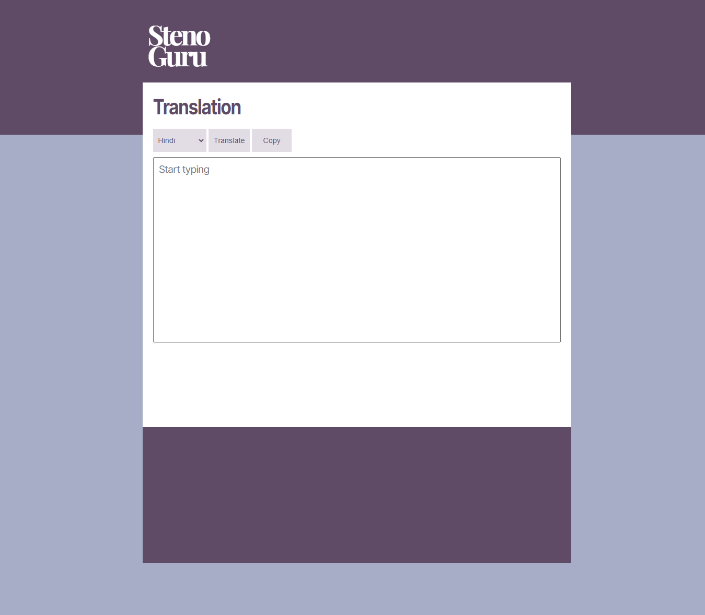

# translation-api

Design Inspired by [Fontsquirrel](https://www.fontsquirrel.com/)

# Introduction
This is a webapp that allows you to translate your text from *English language* to **fourteen** different *Indian languages*.

It uses google's api to translate languages.

# How TO USE
You will have to user your own api key for this to work.
You can add your api key by following these steps:
- Go to js folder
- Open sample-config.js
- Replace the placeholder string with your own api key
- Rename sample-config.js to config.js

## Without your api key this won't work so make sure you follow the above steps.

# Languages Supported
- Assamese
- Bengali
- Bhojpuri
- Gujrati
- Hindi
- Kannada
- Malyalam
- Marathi
- Nepali
- Odia
- Punjabi
- Sanskrit
- Tamil
- Telugu

# Features
- Realtime Translation
- Single click translation
- 14 Supported Languages
- Copy Translated text
- [More support for languages can be found here](https://stenoguru.com/typing/)
